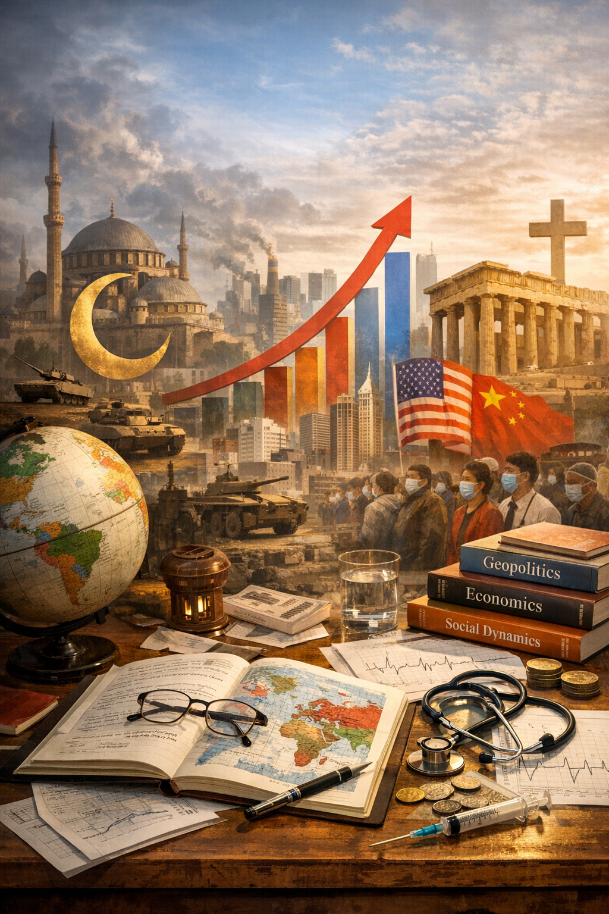

This section gathers my notes and reflections on how societies function at the scale of nations and civilizations.  
The primary focus is geopolitics, but the scope extends to religion, public health, economic policy, and other structural forces that shape collective life.

The perspective presented here is that of a European citizen attempting to make sense of complex geopolitical and societal systems.  
My understanding is necessarily partial and shaped by cultural, historical, and informational biases.  
I strive for analytical distance and rely on multiple sources, yet neutrality remains an objective rather than a certainty. 

This project also serves a structural purpose: to categorize, archive, and organize information in a fast-moving environment where events quickly displace one another and collective memory tends to be short-lived.

All entries are supported by references, images, and external sources whenever possible.

---

## 🌍 Geopolitics 🌍

Geopolitics is the core of this section.

My sustained interest began around 2014, a period marked by renewed great-power tensions and visible fractures in the international order, with Russian annexation of Crimea.  
Since then, I have tried to understand:

* **Wars and armed conflicts**  
  [Russia-Ukraine War](/society/wars/russo-ukranian_war), [Gaza Strip War](/society/wars/gaza_war), the various Iran-linked conflicts across the Middle East, Yemen civil war, Syria, Nagorno-Karabakh, Sudan, and other active or recently frozen battlefields.  

* **Strategic rivalries between major powers**  
  USA-China systemic competition, West-Russia confrontation, Iran’s positioning vis-à-vis the West and regional actors, India-Pakistan tensions, India-China border disputes, China-Taiwan tensions, Turkey-EU frictions, etc.  

* **Regional instability and frozen/semi-frozen conflicts**  
  Kashmir, Hong Kong’s political transformation, North–South Korea standoff, Yemen and the Houthis, Transnistria, Abkhazia and South Ossetia, Kosovo–Serbia tensions, Sahel instability, Western Sahara, etc.  

* **Alliances, blocs, and shifting diplomatic alignments**  
  BRICS, NATO, Shanghai Cooperation Organisation, European Union, AUKUS, QUAD, CSTO, Gulf Cooperation Council, African Union, ASEAN, etc.  

* **Historical context behind present crises**  
  Collapse of the Soviet Union, NATO enlargement, Yugoslav wars, the Taiwan question and Chinese civil war legacy, colonial borders in Africa and the Middle East, the Iranian Revolution of 1979, US interventions post-9/11, Arab Spring, etc.

The emphasis is not only on events, but on underlying structures: geography, demographics, energy routes, military doctrines, and long-term strategic interests.  
History is treated as a necessary layer of analysis rather than background noise.

---

## ☪️ Religions and Civilizational ☪️

Religion remains a major organizing force in many societies and often intersects with law, identity, and political legitimacy.

This subsection explores:

* How major religions are structured institutionally
* Geographic distribution and demographic weight
* Internal diversity within religious traditions
* The interaction between religion and state power

There is particular attention to Islamic societies and major Asian religious traditions, given their demographic scale and their influence on domestic and foreign policy in several regions.  
The goal is not theological analysis, but institutional and geopolitical relevance.

---

## 🧬 Public Health and Collective Risk 🧬

The COVID-19 pandemic exposed structural strengths and weaknesses in global governance, national preparedness, and public trust.

This part examines:

* Pandemic management models
* Public health institutions
* Data transparency and statistical interpretation
* The balance between civil liberties and emergency measures
* Long-term societal impact of health crises

Health is treated as a geopolitical and economic variable, not only a medical issue.

---

## 💶 Economic & Resource Stability 💶

Economic stability underpins social cohesion and political legitimacy.

Topics include:

* Crisis management tools (monetary and fiscal policy)
* Sanctions and economic warfare
* Energy dependence and supply chains
* Inflation, debt dynamics, and structural reform
* The interaction between state intervention and market mechanisms

This area partially overlaps with the ["Finance"](/finance/) section of this PKM, but here the focus is macro-level: how economies function under systemic pressure and how policy choices reshape societies.

---

## Additional Dimensions

Depending on relevance, this section may also address:

* Demographics and migration
* Cultural narratives and identity politics
* Information warfare and media ecosystems
* Institutional decay or resilience

These themes are considered insofar as they influence national cohesion, international positioning, or conflict dynamics.

---

## Method and Limitations

* Sources are cited whenever possible.
* Visual material (maps, charts, timelines) is used to support analysis.
* Interpretations are subject to revision as new information emerges.

This section is not an authoritative account of global affairs.  
It is a structured attempt to understand how societies operate under pressure, how power is distributed, and how narratives shape reality.

The objective is clarity, not certainty.